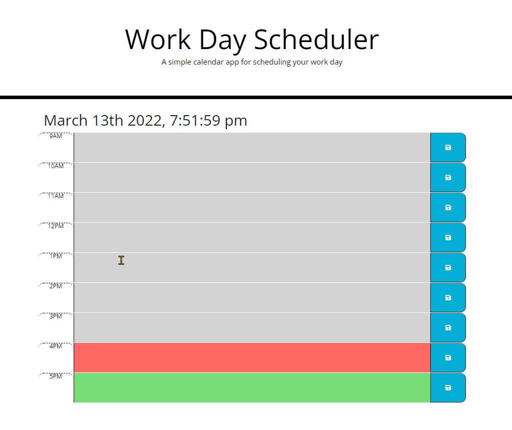

# Work Day Scheduler Starter Code

## Intructions:

- Help plan your day by typing activities into the text field and save them. 
- The grey text field indicates an hour block that has passed.
- The red text field indicates the currnet hour of the day.
- The green text field indicates upcoming hours.

## Links: 
- Github Repo: https://github.com/Steffen568/calendar
- Deployed App: https://steffen568.github.io/calendar/
